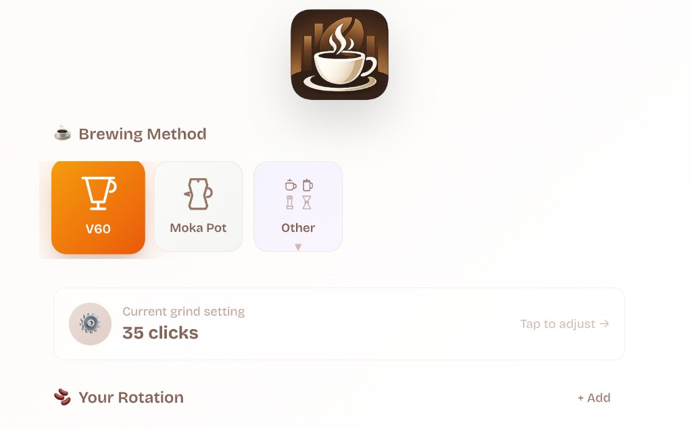
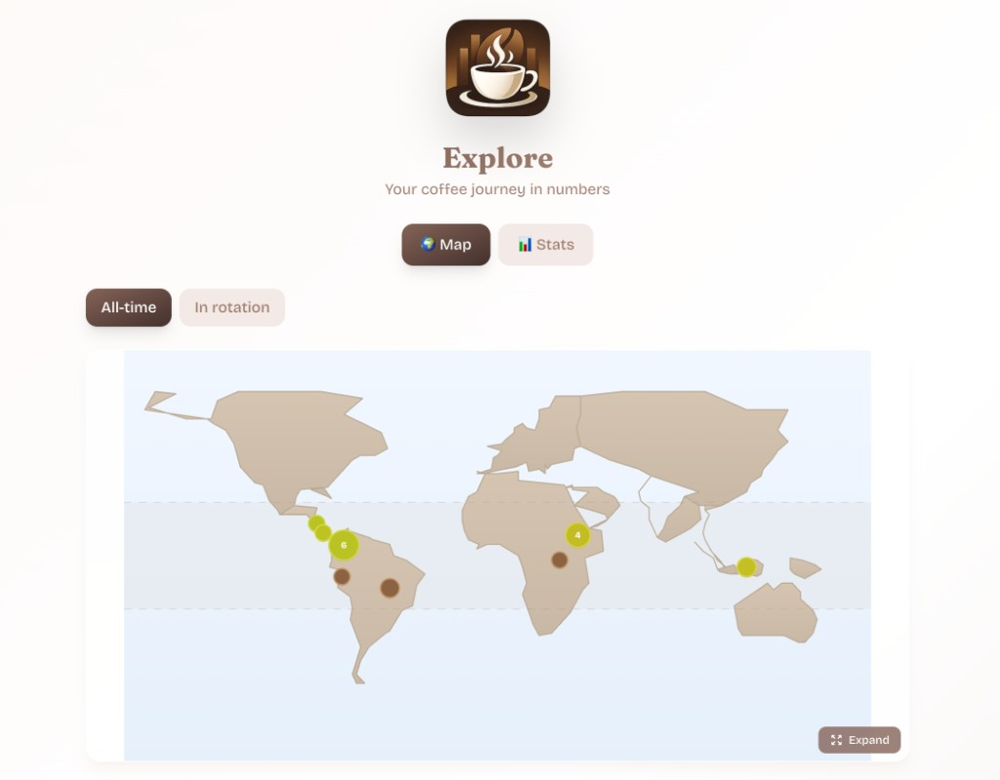
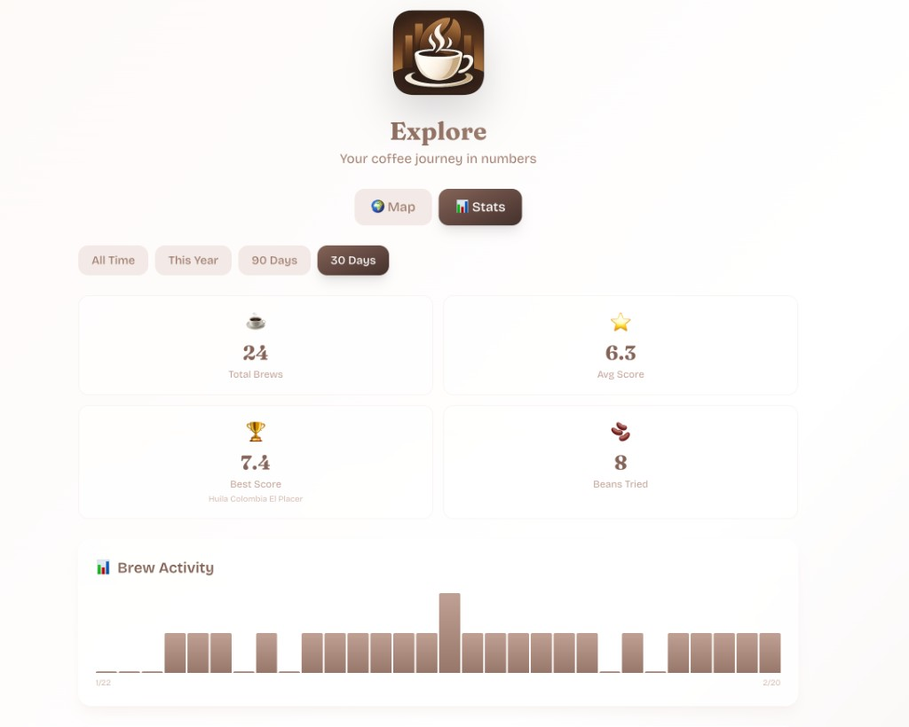

<p align="center">
  
</p>

<h1 align="center">Kissa</h1>

<p align="center">
  <strong>A self-hosted coffee companion that learns how you brew.</strong>
  <br />
  Track beans, dial in your grinder, rate every cup — and get suggestions to make the next one better.
  <br />
  <br />
  No cloud. No accounts. Just coffee.
</p>

<p align="center">
  <a href="#features">Features</a> •
  <a href="#screenshots">Screenshots</a> •
  <a href="#installation">Installation</a> •
  <a href="#usage">Usage</a>
</p>

---

## Screenshots

<p align="center">
  
  &nbsp;&nbsp;
  
  &nbsp;&nbsp;
  
</p>

## Features

- **Brew tracking** — Log brews with V60, Moka Pot, Espresso, or French Press recipes that scale by servings
- **Bean & roaster library** — Origins, varietals, processes, roast levels, and tasting notes, organized by roaster
- **Grinder dial-in** — See "+3 clicks coarser" instead of absolute numbers — always know which way to turn
- **Brew suggestions** — Rate each cup on 5 sliders, get a concrete suggestion for next time
- **Freeze & thaw** — Pause the aging clock on bags you're saving, with accurate days-off-roast tracking
- **World map & stats** — See where your coffee comes from, plus brew activity, top beans, and tasting note trends
- **Offline support** — Queue brews and ratings offline, sync when you're back
- **Simple backups** — All data in a single SQLite file

## Installation

Kissa runs as two Docker containers (API + Web) on a Raspberry Pi or any Linux host.

```bash
# Clone the repo
git clone https://github.com/anner-klein/kissa.git
cd kissa

# Configure your Pi's connection details
cp .env.example .env
# Edit .env with your Pi's hostname, SSH user, and password

# Deploy
./deploy.sh --clean
```

The deploy script builds ARM64 Docker images on your machine, transfers them to the Pi, and starts everything. Takes about 2 minutes.

You can also deploy individual services:

```bash
./deploy.sh --api-only --clean
./deploy.sh --web-only --clean
```

Or use Docker Compose directly on any host:

```bash
docker compose -f docker/docker-compose.yml up -d
```

Once running, open `http://<your-pi>:3000` in a browser.

## Usage

### Brew Flow

1. **Pick a method** on the home screen
2. **Choose a bean** — each card shows how far to adjust your grinder
3. **Brew** with the scaled recipe
4. **Rate** the cup — Kissa tells you what to change next time

### Managing Beans

Add beans with their origin, roaster, and tasting notes. Each bean can have multiple **bags** (purchases) with individual roast dates and freshness tracking. Grind settings are saved per bean per method, so they carry over when you buy a new bag.

### Backups

Download a backup anytime:

```bash
curl -o kissa-backup.db http://<your-pi>:3001/internal/backup/db
```

## Local Development

```bash
# Prerequisites: Node.js 22+, pnpm 9+
pnpm install
pnpm db:generate && pnpm db:push && pnpm --filter @kissa/api db:seed
pnpm dev
```

Web at `localhost:3000`, API at `localhost:3001`.

## Tech Stack

TypeScript monorepo — Fastify + Prisma + SQLite API, Next.js 15 web app, Tailwind CSS, Zustand, TanStack React Query. Managed with Turborepo and pnpm workspaces.

## License

This project is open source. See the [LICENSE](LICENSE) file for details.
