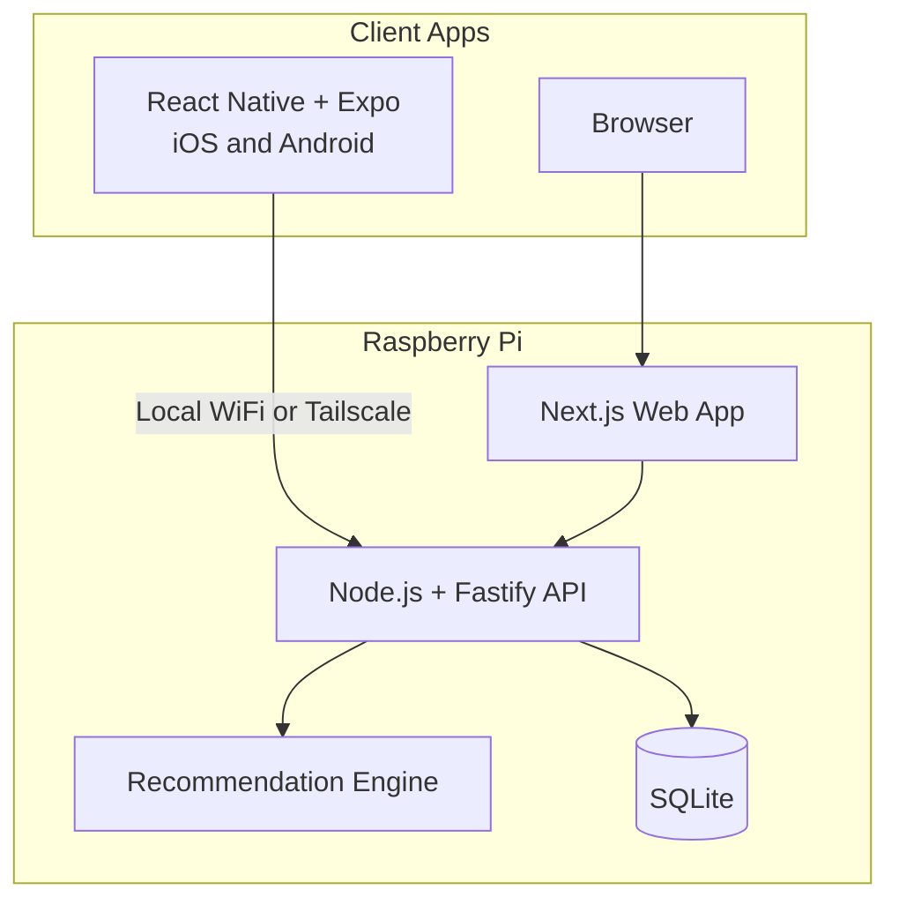
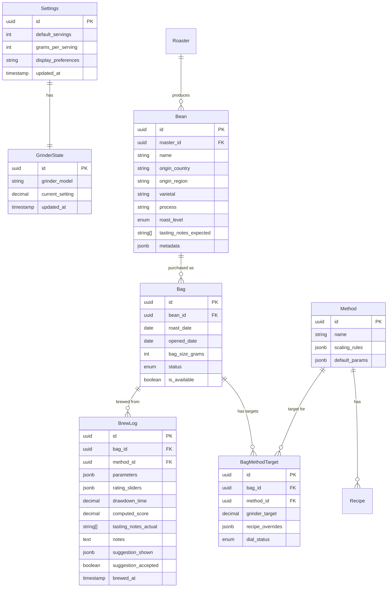

# Kissa Coffee App Development Plan

## Recommended Architecture



- It should be built in the directory kissa, under ..../workspace/mind/kissa

### Technology Stack

| Layer | Technology | Rationale |

|-------|-----------|-----------|

| **Mobile** | React Native + Expo | Cross-platform, OTA updates, shared React patterns with web |

| **Web** | Next.js 14 (App Router) | SSR, great DX, shares React components/hooks |

| **Backend API** | Node.js + Fastify + TypeScript | Fast, type-safe, runs well on RPi ARM |

| **Database** | SQLite + Prisma ORM | Lightweight, file-based, no separate service, perfect for RPi |

| **Auth** | None (single-user) | No login needed for household use; optional simple PIN later |

| **Hosting** | Docker Compose on RPi | Self-hosted, all data on your device |

| **Remote Access** | Tailscale (optional) | Zero-config VPN for access outside home WiFi |

| **Maps** | Mapbox GL | Custom styling for coffee origins, works on mobile and web |

| **State** | Zustand + TanStack Query | Lightweight, works across platforms |

| **Shared** | TypeScript monorepo (Turborepo) | Shared types, validation (Zod), business logic |

### Deployment Options

**Primary: Self-hosted on Raspberry Pi**

- Docker Compose runs API + Web + SQLite
- Data persisted to RPi storage (recommend external SSD for longevity)
- Access via local IP on home WiFi (e.g., `http://kissa.local:3000`)
- Optional: Tailscale for secure remote access without port forwarding

**Future: Cloud deployment**

- Same codebase deploys to Vercel (web) + Railway (API)
- Swap SQLite for PostgreSQL via Prisma migration
- Add Clerk auth for multi-user support
- Environment variables control deployment target

---

## Data Model

Single-user mode: No User table needed. All data belongs to the household.



---

## Monorepo Structure

```
kissa/
├── apps/
│   ├── mobile/                 # React Native + Expo
│   │   ├── src/
│   │   │   ├── screens/        # Screen components
│   │   │   ├── components/     # Mobile-specific components
│   │   │   └── navigation/     # React Navigation setup
│   │   └── app.json
│   │
│   ├── web/                    # Next.js 14
│   │   ├── app/                # App Router pages
│   │   ├── components/         # Web-specific components
│   │   └── next.config.js
│   │
│   └── api/                    # Fastify API server
│       ├── src/
│       │   ├── routes/         # API endpoints
│       │   ├── services/       # Business logic
│       │   ├── recommendation/ # Suggestion engine
│       │   └── db/             # Prisma client
│       └── prisma/
│           └── schema.prisma
│
├── packages/
│   ├── shared/                 # Shared TypeScript code
│   │   ├── types/              # Zod schemas + TS types
│   │   ├── constants/          # Methods, scaling rules
│   │   ├── scoring/            # Smart score calculation
│   │   └── utils/              # Grinder delta calc, etc.
│   │
│   ├── ui/                     # Shared UI components (optional)
│   │   └── src/                # Cross-platform primitives
│   │
│   └── api-client/             # Type-safe API client
│       └── src/
│
├── docker/
│   ├── docker-compose.yml      # RPi deployment
│   ├── docker-compose.dev.yml  # Local development
│   ├── api.Dockerfile
│   └── web.Dockerfile
│
├── turbo.json
├── package.json
└── pnpm-workspace.yaml
```

---

## Docker Deployment (RPi)

### docker-compose.yml

```yaml
version: '3.8'
services:
  api:
    build:
      context: .
      dockerfile: docker/api.Dockerfile
    ports:
      - "3001:3001"
    volumes:
      - kissa-data:/app/data  # SQLite database
    environment:
      - DATABASE_URL=file:/app/data/kissa.db
      - NODE_ENV=production
    restart: unless-stopped

  web:
    build:
      context: .
      dockerfile: docker/web.Dockerfile
    ports:
      - "3000:3000"
    environment:
      - API_URL=http://api:3001
    depends_on:
      - api
    restart: unless-stopped

volumes:
  kissa-data:
    driver: local
```

### RPi Setup Commands

```bash
# On your Raspberry Pi (assumes Docker installed)
git clone <your-repo> kissa
cd kissa

# Build for ARM architecture
docker compose build

# Start services
docker compose up -d

# View logs
docker compose logs -f

# Access at http://<rpi-ip>:3000
```

### Optional: mDNS for kissa.local

Add to RPi's `/etc/avahi/services/kissa.service`:

```xml
<service-group>
  <name>Kissa Coffee</name>
  <service>
    <type>_http._tcp</type>
    <port>3000</port>
  </service>
</service-group>
```

Then access via `http://kissa.local:3000` from any device on your network.

### Mobile App Configuration

The React Native app needs to know the API URL:

```typescript
// packages/api-client/src/config.ts
export const API_URL = 
  __DEV__ 
    ? 'http://localhost:3001'           // Development
    : process.env.EXPO_PUBLIC_API_URL   // Production (set in app config)
    || 'http://kissa.local:3001';       // Default to mDNS
```

For Expo, set in `app.config.js`:

```javascript
export default {
  expo: {
    extra: {
      apiUrl: process.env.API_URL || 'http://kissa.local:3001',
    },
  },
};
```

---

## Screen-by-Screen Implementation

### Screen A: Morning (Home)

**Purpose**: Sub-30-second brew selection

**Components**:

- `MethodPicker` - Horizontal scroll of method icons (V60, Moka)
- `AvailableBeanCard` - Roaster, bean name, roast date, last score, grinder delta preview
- `GrinderDeltaPreview` - "Move +2 from current" badge

**API Endpoints**:

- `GET /api/available-beans` - Returns available bags with computed grinder deltas
- Computed field: `grinderDelta = bagTarget - currentGrinderState`

**Key Logic** (in `packages/shared`):

```typescript
function computeGrinderDelta(
  currentSetting: number,
  bagMethodTarget: number
): { direction: 'finer' | 'coarser'; clicks: number } 
```

---

### Screen B: Brew

**Purpose**: Execute brew without friction

**Sections**:

1. **Grinder Card** - Current / Target / Delta with "Applied" button
2. **Servings** (collapsed) - `servings × gramsPerServing = totalDose`
3. **Recipe Card** - Structured inputs + steps list + notes
4. **Actions** - "Start Brew" (optional), "Finish and Log"

**Scaling Logic** (method-specific, in `packages/shared`):

```typescript
// V60: Scale all pours proportionally
function scaleV60Recipe(baseRecipe: V60Recipe, scaleFactor: number): V60Recipe

// Moka: Scale dose only, keep technique steps unchanged
function scaleMokaRecipe(baseRecipe: MokaRecipe, scaleFactor: number): MokaRecipe
```

**API Endpoints**:

- `POST /api/grinder/apply` - Updates current grinder state
- `POST /api/brews` - Creates brew log
- `PATCH /api/brews/:id` - Updates brew log

---

### Screen C: Rate and Learn

**Purpose**: Capture feedback, generate actionable suggestion

**Inputs**:

- Drawdown time (V60 only)
- Rating sliders: Balance (sour↔bitter), Sweetness, Clarity, Body, Finish/Astringency
- Tasting notes (optional): Multi-select from common notes + custom entry
                                                                                                                                                                                                                                                                - Shows bean's expected notes as reference: "Roaster says: chocolate, cherry, citrus"
                                                                                                                                                                                                                                                                - User selects/types what they actually taste
- Freeform notes

**Outputs**:

- Computed score (background, displayed)
- Primary suggestion + optional secondary
- Action buttons: "Apply to bag recipe" / "Apply next brew only" / "Ignore"

**Recommendation Engine** (`apps/api/src/recommendation/`):

```typescript
interface SuggestionInput {
  method: 'v60' | 'moka';
  sliders: RatingSliders;
  drawdownTime?: number;
  parameters: BrewParameters;
  previousBrews: BrewLog[];
}

interface Suggestion {
  primary: { variable: string; action: string; rationale: string };
  secondary?: { variable: string; action: string; rationale: string };
}

function generateSuggestion(input: SuggestionInput): Suggestion
```

**V1 Suggestion Rules** (hardcoded heuristics):

- Sour + low sweetness + short drawdown → finer grind OR higher temp
- Bitter/astringent + long drawdown → coarser grind OR lower temp OR reduce agitation
- Low clarity → coarser grind
- Low sweetness alone → check water temp

**Learning Loop** (v1.5):

- Track `suggestion_shown`, `suggestion_accepted`, next brew score delta
- Use this data to weight suggestions per user

**API Endpoints**:

- `PATCH /api/brews/:id/rating` - Submit rating and get suggestion
- `POST /api/brews/:id/apply-suggestion` - Apply suggestion to bag or next brew

---

### Screen D: Bean + Bag Profile

**Purpose**: Canonical record of a bean and its bags

**Sections**:

- Bean metadata header (roaster, name, origin, process, roast level)
- **Tasting Notes Comparison** (when brews exist):
                                                                                                                                - "Roaster says: chocolate, cherry, citrus"
                                                                                                                                - "You've tasted: dark chocolate (5x), cherry (3x), plum (2x), citrus (1x)"
                                                                                                                                - Visual: tag cloud or bar chart showing frequency of your notes vs expected
- Bags list with status badges (unopened/open/finished)
- Per-bag: target settings per method, dial status, brew history

**API Endpoints**:

- `GET /api/beans/:id` - Full bean with bags and brew history
- `POST /api/beans` - Create bean
- `POST /api/beans/:id/bags` - Add bag to bean
- `PATCH /api/bags/:id` - Update bag (status, opened date, etc.)
- `PATCH /api/bags/:id/targets/:methodId` - Update grinder target

---

### Screen E: World Map Analytics

**Purpose**: Geographic exploration of your coffee history

**Components**:

- `WorldMap` - Mapbox GL with bubble markers
- `CountryDrilldown` - Regions within country
- `RegionList` - Ranked list of beans from region
- `BlendsUnknownSidebar` - Off-map beans

**Toggle Controls**:

- Available only vs All-time
- Count by: Beans (default) / Brews

**Sorting ("Best" definition)**:

```typescript
function computeBestScore(bean: BeanWithBrews): number {
  const avgScore = mean(bean.brews.map(b => b.computed_score));
  const confidence = Math.min(bean.brews.length / 3, 1); // Max at 3 brews
  return avgScore * (0.7 + 0.3 * confidence); // Slight boost for reproducibility
}
```

**API Endpoints**:

- `GET /api/analytics/map` - Aggregated data for world map
- `GET /api/analytics/country/:code` - Regions within country
- `GET /api/analytics/region/:code` - Beans in region with scores

---

## Smart Score Calculation

Located in `packages/shared/scoring/`:

```typescript
const SLIDER_WEIGHTS = {
  balance: 0.25,      // Most important - extraction accuracy
  sweetness: 0.25,    // Key quality indicator
  clarity: 0.20,      // Clean cup
  body: 0.15,         // Mouthfeel
  finish: 0.15,       // Aftertaste quality
};

function computeSmartScore(sliders: RatingSliders): number {
  // Balance is centered (5 = optimal), others are higher = better
  const balanceScore = 10 - Math.abs(sliders.balance - 5) * 2;
  
  return (
    balanceScore * SLIDER_WEIGHTS.balance +
    sliders.sweetness * SLIDER_WEIGHTS.sweetness +
    sliders.clarity * SLIDER_WEIGHTS.clarity +
    sliders.body * SLIDER_WEIGHTS.body +
    sliders.finish * SLIDER_WEIGHTS.finish
  );
}
```

---

## Onboarding Flow

Single-page progressive onboarding:

1. **Welcome** - App intro
2. **Household Setup** - Default servings (2) and grams per serving (15g)
3. **Grinder Setup** - Model (Comandante + Red Clix), current setting
4. **First Bean** - Add 1-3 beans with required fields only (roaster, name, origin country)
5. **First Bag** - Roast date (required), mark as available
6. **Ready** - Navigate to Morning screen

**API Endpoints**:

- `POST /api/onboarding` - Bulk create user preferences, grinder, beans, bags

---

## Development Phases

### Phase 1: Foundation

- Monorepo setup with Turborepo + pnpm
- SQLite database schema + Prisma setup
- Docker Compose configuration for RPi
- Core API routes: settings, beans, bags, methods, grinder
- Shared types and Zod validation schemas

### Phase 2: Core Screens

- Morning screen (mobile + web)
- Brew screen with grinder state management
- Basic brew logging
- Bean/Bag profile screens

### Phase 3: Rating and Recommendations

- Rate and Learn screen
- Smart score calculation
- V1 recommendation engine (rule-based)
- Suggestion application flow

### Phase 4: Analytics

- World map component (Mapbox integration)
- Country/region drilldowns
- Ranking and sorting logic
- Blends/Unknown handling

### Phase 5: Polish and Deploy

- Onboarding flow (simplified for single-user)
- Offline support (optimistic updates with sync)
- RPi deployment testing and optimization
- Mobile builds (Expo EAS or local)
- Documentation for self-hosting

---

## Key Technical Decisions

1. **Self-hosted first** - Docker Compose on RPi is primary deployment; cloud is optional upgrade path
2. **SQLite for simplicity** - File-based, no separate DB service, easy backup (just copy the file)
3. **Single-user by default** - No auth overhead; Settings table stores household preferences
4. **Grinder State is server-authoritative** - Always synced, "Applied" writes immediately
5. **Recipes are hybrid** - Structured JSON fields + freeform notes, not pure text
6. **Scaling is method-aware** - Scaling rules defined per method in shared constants
7. **Suggestions are deterministic v1** - Rule-based, learning loop added in v1.5
8. **Available is a bag property** - Simple boolean, filtered on all list queries
9. **Mobile connects via local IP** - Use mDNS (kissa.local) or Tailscale for seamless access

---

## Tasting Notes System

### Common Notes Vocabulary

Provide a curated list of common coffee tasting notes for easy selection:

```typescript
const TASTING_NOTE_CATEGORIES = {
  fruity: ['cherry', 'blueberry', 'strawberry', 'citrus', 'lemon', 'orange', 'apple', 'grape', 'tropical', 'mango', 'passionfruit'],
  sweet: ['chocolate', 'dark chocolate', 'milk chocolate', 'caramel', 'honey', 'brown sugar', 'maple', 'molasses', 'vanilla'],
  nutty: ['almond', 'hazelnut', 'walnut', 'peanut', 'pecan'],
  floral: ['jasmine', 'rose', 'lavender', 'bergamot', 'hibiscus'],
  spicy: ['cinnamon', 'clove', 'cardamom', 'ginger', 'pepper'],
  earthy: ['tobacco', 'leather', 'cedar', 'oak', 'mushroom'],
  other: ['wine', 'winey', 'tea-like', 'bright', 'clean', 'complex', 'balanced'],
};
```

### Palate Development Analytics (v1.5)

- **Note accuracy over time**: How often do your tasted notes match roaster's expected notes?
- **Personal flavor profile**: "You frequently taste: dark chocolate, berry, citrus"
- **Origin correlation**: "Ethiopian naturals: you taste blueberry 80% of the time"
- **Method impact**: "On V60 you pick up more floral notes than Moka"

---

## V1.5 Roadmap (Post-Launch)

- Time-window analytics filters
- Stable vs Dialing-in mode per bag
- Inventory tracking (remaining estimate)
- Espresso + French Press methods
- Preference profiling ("you prefer washed Ethiopias on V60")
- **Palate analytics**: Note accuracy, personal flavor profile, origin correlations
- Export/sharing features
- Learning loop for personalized suggestions
- **Optional cloud deployment**: Migrate to PostgreSQL, add Clerk auth, deploy to Vercel/Railway
- **Multi-user support**: Household members with separate preferences (requires auth)